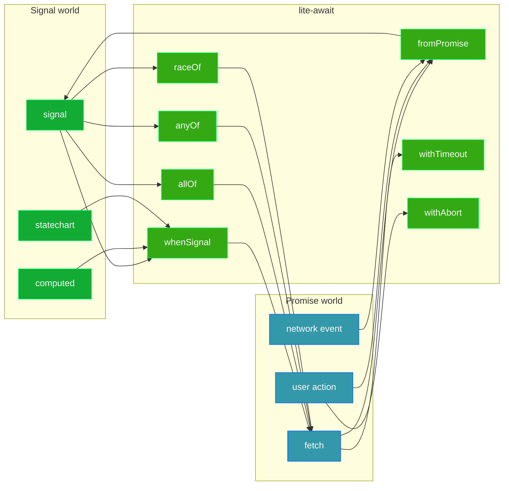

# @zakkster/lite-await

[](https://www.npmjs.com/package/@zakkster/lite-await)
[](https://github.com/sponsors/PeshoVurtoleta)
[](https://bundlephobia.com/result?p=@zakkster/lite-await)
[](https://www.npmjs.com/package/@zakkster/lite-await)
[](https://www.npmjs.com/package/@zakkster/lite-await)
[](https://github.com/PeshoVurtoleta/lite-signal)


[](https://opensource.org/licenses/MIT)
[](#)

> Zero-GC bridge between [`@zakkster/lite-signal`](https://www.npmjs.com/package/@zakkster/lite-signal) and the `async`/`await` world. Wait for signal values. Race multi-source predicates. AbortSignal-first cancellation. Bidirectional promise<->signal conversion. The missing async-coordination primitive for the lite-signal ecosystem.

```js
import { whenSignal, allOf, anyOf, raceOf, withTimeout, fromPromise } from "@zakkster/lite-await";
import { signal } from "@zakkster/lite-signal";

const auth = signal("anonymous");

// Wait for a signal to satisfy a predicate -- with deadline and cancellation.
const ctrl = new AbortController();
const token = await whenSignal(
    auth,
    (s) => s === "authenticated",
    { timeout: 5000, signal: ctrl.signal }
);

// Race success against failure (the EBS / Twitch Bits pattern).
const response = signal(null);
const error    = signal(null);
const result = await raceOf([
    [response, (r) => r !== null],
    [error,    (e) => e !== null]
], { timeout: 10000 });
if (result.index === 1) throw new Error(result.value);
```

---

## Why this exists

`lite-signal` is the reactive primitive: synchronous, pull-based, zero-GC. Every consumer hits the same question on day one -- **"how do I `await` a signal becoming X?"** -- and the naive answer is wrong in five places:

```js
// DON'T do this. It looks fine. It leaks.
function waitFor(sig, pred) {
    return new Promise((resolve) => {
        const stop = sig.subscribe((v) => {
            if (pred(v)) { stop(); resolve(v); }
        });
    });
}
```

1. **No cancellation.** If the caller aborts (component unmount, room dispose), the subscription leaks.
2. **No timeout.** Every "wait for X" wants a deadline; there's nowhere safe to add it.
3. **Initial-state races.** `subscribe` fires immediately; ordering bugs are subtle.
4. **No rejection path.** Signals don't reject. Where does the Promise's failure come from?
5. **Pool leaks.** Every leaked subscription holds an observer slot; under load you exhaust the lite-signal pool.

`lite-await` ships the primitive that fixes all five. **Settlement -- by resolve, abort, or timeout -- always cleans the underlying effect.** Tested with a 4096-cycle leak probe.

---

## Architecture



The bridge is bidirectional. Signals flow to Promises via `whenSignal` / combinators. Promises flow back to signals via `fromPromise`. The boundary disappears.

---

## Install

```bash
npm install @zakkster/lite-await @zakkster/lite-signal
```

ESM only. Node `>=18` (for `AggregateError`, `AbortController`, `DOMException`). No runtime dependencies; `lite-signal` is a peer dep.

---

## API

Every awaiter accepts the same options shape:

```ts
interface AwaitOptions {
    timeout?: number;      // ms; rejects with TimeoutError
    signal?: AbortSignal;  // first-class cancellation
}
```

### Core primitives

#### `whenSignal(source, predicate, opts?) -> Promise<T>`

Resolve when `source()` first satisfies `predicate`. Cleans up structurally.

```js
const status = signal("loading");
const v = await whenSignal(status, (s) => s === "ready", { timeout: 5000 });
// v === "ready"
```

If the predicate is already satisfied on first read, resolves on the next microtask without waiting for a change.

#### `allOf(specs, opts?) -> Promise<T[]>`

Wait for every `[source, predicate]` spec. Resolves with the values in input order. On any failure (rejection, timeout, abort), the remaining in-flight specs are aborted.

```js
const [user, room, peers] = await allOf([
    [jwt,    (j) => j !== null],
    [state,  (s) => s === "joined"],
    [count,  (n) => n >= 2]
], { timeout: 10000 });
```

#### `anyOf(specs, opts?) -> Promise<{index, value}>`

First spec to resolve wins. Losing specs are aborted on win. Rejects with `AggregateError` only if **every** spec rejects.

```js
const winner = await anyOf([
    [primary,   (r) => r !== null],
    [fallback,  (r) => r !== null],
    [cache,     (r) => r !== null]
]);
console.log("source", winner.index, "won with", winner.value);
```

#### `raceOf(specs, opts?) -> Promise<{index, value}>`

First spec to **settle** wins -- success or failure cascades. Use this for "success-or-error" patterns where any failure should propagate.

```js
// EBS request/response pattern
const r = await raceOf([
    [response, (r) => r?.txid === id],
    [error,    (e) => e?.txid === id]
], { timeout: 10000 });
if (r.index === 1) throw new EBSError(r.value);
return r.value;
```

### Promise wrappers (for arbitrary, non-signal promises)

#### `withTimeout(promise, ms) -> Promise<T>`

Wrap any Promise with a deadline. Rejects with `TimeoutError` if `ms` elapses first. **The inner promise is not cancelled** (it can't be; arbitrary promises aren't AbortSignal-aware). For signal-based work, use the `timeout` option on the primitives -- they DO cancel their own effects.

```js
const data = await withTimeout(fetch("/api/health"), 3000);
```

#### `withAbort(promise, signal) -> Promise<T>`

Wrap any Promise with an AbortSignal. Same caveat as `withTimeout`: inner work continues.

```js
const data = await withAbort(fetch("/api/data"), userCtrl.signal);
```

### Convenience shorthands

```js
await whenTruthy(loading);              // sig becomes truthy
await whenEquals(state, "ready");       // sig === "ready" (Object.is)
```

### Bidirectional bridge

#### `fromPromise(promise, initialData?) -> Signal<AsyncState<T>>`

Drive a single signal from a Promise's lifecycle. The signal holds one of three shapes:

```ts
{ status: "pending",  data: initialData, error: undefined }
{ status: "resolved", data: T,           error: undefined }
{ status: "rejected", data: initialData, error: unknown   }
```

Updates exactly once on settlement. Use in `effect()` for UI; dispose via `dispose(sig)` from lite-signal when done.

```js
const userQuery = fromPromise(fetchUser(id), { name: "..." });
effect(() => {
    const s = userQuery();
    if (s.status === "pending")  renderSpinner(s.data);   // initialData fallback
    else if (s.status === "resolved") renderUser(s.data);
    else renderError(s.error);
});
```

### lite-statechart specialization

#### `whenStatechart(machine, stateName, opts?) -> Promise<void>`

Hooks into `machine.onTransition` directly (one observer slot) instead of tracking the state signal (one effect node). Duck-typed: any object exposing `state.peek()` and `onTransition(fn)` works.

```js
import { createStatechart } from "@zakkster/lite-statechart";

const machine = createStatechart({ /* ... */ });
machine.send("CONNECT");
await whenStatechart(machine, "live", { timeout: 5000 });
```

### Errors

#### `TimeoutError extends Error`

`{ name: "TimeoutError", timeout: number }`. The numeric `timeout` field is the ms value that elapsed.

```js
try { await whenSignal(s, p, { timeout: 100 }); }
catch (e) {
    if (e.name === "TimeoutError") console.log("deadline was", e.timeout, "ms");
}
```

Abort errors are platform-shaped: the signal's `reason` if set (DOM spec), otherwise `DOMException("Aborted", "AbortError")`, otherwise an `Error` named `AbortError`.

---

## Integration recipes

### `lite-room`: room.ready() / waitForPeers

> **[Preview]** -- the `lite-room 1.1` API shown here is upcoming. Pattern preview against the current `lite-room 1.0` core.

```js
import { signal, dispose } from "@zakkster/lite-signal";
import { whenSignal, anyOf } from "@zakkster/lite-await";

export function createRoom(config) {
    const state    = signal("disconnected");
    const peers    = signal([]);
    const error    = signal(null);
    const ctrl     = new AbortController();

    return {
        connect() { state.set("connecting"); /* ... */ },

        // Resolves when state === "live" OR rejects on error/timeout/dispose.
        async ready(opts) {
            return whenSignal(state, (s) => s === "live", {
                timeout: opts?.timeout ?? 5000,
                signal: opts?.signal ?? ctrl.signal
            });
        },

        // First-to-settle: peer joins OR error happens.
        async waitForPeer(opts) {
            return anyOf([
                [peers, (p) => p.length > 0],
                [error, (e) => e !== null]
            ], opts);
        },

        dispose() {
            ctrl.abort();                      // cancels in-flight ready() / waitForPeer()
            dispose(state); dispose(peers); dispose(error);
        }
    };
}
```

### Twitch Extension SDK: sdk.ready() / EBS request

> **[Preview]** -- `@zakkster/lite-twitch 1.0` is in development. Pattern preview showing how `lite-await` will integrate with the auth machine + EBS request layer.

```js
import { whenStatechart, raceOf, withTimeout, fromPromise } from "@zakkster/lite-await";

export function createTwitchSDK() {
    const authMachine = createStatechart({ /* anonymous -> validating -> authenticated */ });
    const jwt         = signal(null);
    const ebsResponse = signal(null);
    const ebsError    = signal(null);

    return {
        async ready(opts) {
            await whenStatechart(authMachine, "authenticated", {
                timeout: opts?.timeout ?? 3000
            });
            return { jwt: jwt.peek() };
        },

        // EBS transaction: response-or-error race with deadline.
        async sendTransaction(txid, payload) {
            const r = await raceOf([
                [ebsResponse, (resp) => resp?.txid === txid],
                [ebsError,    (err)  => err?.txid === txid]
            ], { timeout: 10000 });
            if (r.index === 1) throw new EBSError(r.value);
            return r.value;
        },

        // Project a fetch into a signal-shaped resource.
        product(id) {
            return fromPromise(fetch(`/products/${id}`).then((r) => r.json()));
        }
    };
}
```

### Frame-rate-safe loop coordination

Inside a render loop you want to wait for the next physics tick to clear without allocating Promises every frame. `lite-await` is for one-shot async coordination, not per-frame. Use signals + `effect()` for per-frame loops; reach for `lite-await` at lifecycle boundaries (load, ready, dispose).

---

## Edge cases (read this before filing bugs)

- **Predicate is called on every source change.** Keep it cheap; no I/O, no allocation.
- **A throwing predicate (or source getter) rejects the promise.** If your predicate or source throws -- on the synchronous first read or on a later change-driven fire -- the promise rejects with the thrown value and the effect tears down. The throw does NOT escape at the signal writer's `.set()` call site. Inside a combinator it follows that combinator's normal rejection contract (`allOf`/`raceOf` reject the bundle; `anyOf` counts it as one rejection).
- **Pre-aborted signal short-circuits.** Every primitive checks `signal.aborted` first and returns a rejected Promise synchronously -- it never constructs internal machinery just to tear it down.
- **`whenSignal` rejects on the next microtask if the predicate is already true on first read.** It still uses `Promise.resolve(...)`, never a synchronous-throw style.
- **`anyOf` rejects with `AggregateError`** carrying every spec's individual rejection -- when all specs failed independently. When the **bundle** aborts (your AbortSignal fires), the rejection is the platform AbortError directly, not wrapped.
- **`raceOf` cascades the first rejection.** Use `anyOf` if you want "best-effort, ignore individual failures."
- **`withTimeout` and `withAbort` do NOT cancel inner work.** They wrap arbitrary Promises. Inner work continues; the result is detached. For cancellable signal work, use the primitive's `timeout`/`signal` options.
- **`fromPromise` updates exactly once.** The signal transitions pending -> resolved or pending -> rejected, then is frozen. Dispose it via lite-signal's `dispose()` when done.
- **`whenStatechart` resolves on the next microtask if already in target.** Same convention as `whenSignal`.
- **Cleanup is structural, not best-effort.** Every settlement path (resolve, reject, timeout, abort) calls the same `fullCleanup` that tears down the effect, clears the timeout, and removes the abort listener. There is no path where one of these is skipped.

---

## Benchmarks

Run `npm run bench` (`node --expose-gc bench/bench.mjs`). Numbers from Node 22 on a M1-class machine, 10K-20K iterations after warmup:

```
whenSignal resolve                 213K ops/s   retained  4.4 B/op
whenSignal pre-aborted              87K ops/s   retained  2.9 B/op
allOf 4-spec resolve               103K ops/s   retained  5.2 B/op
anyOf 4-spec resolve                55K ops/s   retained  2.8 B/op
raceOf 4-spec resolve               60K ops/s   retained  2.9 B/op
fromPromise pending->resolved      228K ops/s   retained  4.6 B/op
```

Per-op retained heap is in the single-digit bytes range. Final lite-signal pool returns cleanly to baseline (zero retained nodes) after each scenario.

---

## Testing

```bash
npm test                    # 81 functional tests (4 GC budgets skip without --expose-gc)
npm run test:gc             # 85 tests incl. 4 heap-budget assertions, under --expose-gc
npm run bench               # the bench scenarios above
npm run verify              # all three
```

The cleanup suite (`test/09-cleanup-leak.test.mjs`) drives 4K whenSignal resolve cycles, 2K timeout cycles, 2K abort cycles, 1K allOf cycles, 1K anyOf cycles, 1K raceOf cycles, and a 500-cycle mixed-settlement aggregate -- every cycle returns the effect node to lite-signal's pool. This is the regression test for the entire library's reason for being.

The GC suite (`test/10-gc.test.mjs`) asserts retained-heap budgets under `--expose-gc`: 10K whenSignal cycles retain < 1 MB, 5K abort cycles retain < 1 MB, 2K allOf cycles retain < 1 MB, 2K anyOf cycles retain < 1 MB.

---

## Ecosystem

`@zakkster/lite-await` is the async-coordination layer of the `@zakkster/lite-*` ecosystem:

- [`@zakkster/lite-signal`](https://www.npmjs.com/package/@zakkster/lite-signal) -- the reactive core (peer dep).
- [`@zakkster/lite-statechart`](https://www.npmjs.com/package/@zakkster/lite-statechart) -- the FSM that pairs with `whenStatechart`.
- [`@zakkster/lite-clock`](https://www.npmjs.com/package/@zakkster/lite-clock) -- deterministic time pool; `attachRAF` complements `lite-await` for frame-by-frame work.
- [`@zakkster/lite-room`](https://www.npmjs.com/package/@zakkster/lite-room) -- the CRDT room; `lite-await` provides its `ready()` and `waitForPeers()` shape.
- [`@zakkster/lite-query`](https://www.npmjs.com/package/@zakkster/lite-query) -- HTTP query manager; `fromPromise` is its core projection primitive.

All packages share the same conventions: ASCII source, `node:test`, zero runtime deps, zero-GC hot paths, MIT license, single-file ESM.

---

## License

MIT (c) 2026 Zahary Shinikchiev `<shinikchiev@yahoo.com>`
